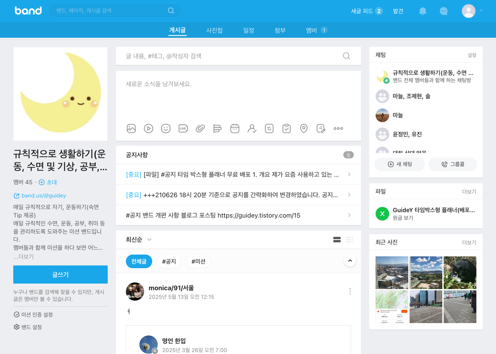

# 가이드윤의 바른 생활 Community service

### 사이트: [가이드윤의 바른 생활](https://guidey.site)

## Back-end 소개

- 규칙적인 생활을 위한 일상 공유 커뮤니티 서비스 '가이드윤의 바른 생활'입니다.
- `spring`으로 서버를 구현하고, `MySQL`로 db를 사용했습니다.
- 개발은 초기 프로젝트 설정부터, db 생성 및 연결, 서버 연결, 프론트엔드 연결까지 `직접 구현`했습니다.
- RCM(Routes-Controllers-Model) 패턴으로 구현했습니다.

### 개발 인원 및 기간

- 개발기간 :  2025-09-15 ~ 2025-12-07
- 개발 인원 : 프론트엔드/백엔드/인프라 1명 (본인)

### 사용 기술 및 tools

- Spring
- MySQL 8.4 LTS

### Front-end

- <a href="https://github.com/brixxt27/jayoon-community-frontend">Front-end Github</a>

### 서비스 시연 영상

- 추후 업로드 예정

### Convention

- [x] [개인 Notion](https://jayoon.notion.site/Convention-2a32ff1a1acc80a6bca6c0d0d70e57b8?source=copy_link)

### API 명세서

- [x] [API 명세서](https://github.com/100-hours-a-week/jayoon-til/blob/main/community-docs/api-specification.md)

## 서버 설계

### 도메인 구조
| 구분 | Route (URI 경로) | Controller (요청 처리) | Model (데이터 구조) |
|:-----|:-----------------|:-----------------------|:--------------------|
| **유저** | `/users/**` | `UserController` | `User` (Entity), `UserResponseDto`, `UserCreateRequestDto` 등 |
| **게시글** | `/posts/**` | `PostController` | `Post` (Entity), `PostResponseDto`, `PostCreateRequestDto` 등 |
| **댓글** | `/posts/{postId}/comments/**` | `PostController` (일반적으로 게시글 **`Controller`** 내에서 처리) | `PostComment` (Entity), `CommentResponseDto`, `CommentCreateRequestDto` 등 |
| **인증** | `/auth/**` | `AuthController` | `UserAuth` (Entity), `LoginRequestDto`, `LoginResponseDto` 등 |
| **이미지** | `/images/**` | `ImageController` | `PostImage` (Entity), `PreSignedUrlResponse` (DTO) |
| **헬스체크** | `/health**` | `Health` | - |
---

### 공통 요소 구조

| 패키지 | 주요 역할 | 주요 클래스 |
|:---|:---|:---|
| `common/config` | 애플리케이션 전역 설정 관리 | `SecurityConfig`, `QuerydslConfig` |
| `common/exception` | 전역 예외 처리 및 공통 예외 정의 | `GlobalExceptionHandler`, `BaseCustomException` |
| `common/security` | 인증(Authentication) 및 인가(Authorization) 담당 | `AuthenticationFilter`, `JwtManager`, `AuthManager` |
| `common/response` | 모든 API 응답의 통일된 형식 정의 | `ApiResponseDto` |
| `common/web` | `@LoginUser` 등 커스텀 어노테이션 및 Argument Resolver 정의 | `LoginUserArgumentResolver` |

### 폴더 구조

<details>
  <summary>폴더 구조 보기/숨기기</summary>
  <div markdown="1">
└── community
    ├── CommunityApplication.class
    ├── common
         ├── config
             ├── PermitAllProperties.class
             ├── QuerydslConfig.class
             ├── SecurityConfig.class
             └── WebConfig.class
         ├── exception
             ├── dto
                 ├── BadRequestException.class
                 ├── BaseCustomException.class
                 ├── ErrorStatusCodeProvider.class
                 ├── ForbiddenException.class
                 ├── NotFoundException.class
                 └── UnauthorizedException.class
             └── handler
                 ├── FilterExceptionHandler.class
                 └── GlobalExceptionHandler.class
         ├── message
             ├── ErrorCode.class
             └── SuccessCode.class
         ├── response
             ├── ApiResponseDto.class
             └── ErrorDetails.class
         ├── security
             ├── CookieManager.class
             ├── auth
                 ├── AuthManager.class
                 ├── AuthenticationFilter.class
                 ├── JwtAuthManager.class
                 └── SessionAuthManager.class
             ├── encoding
                 └── Encoder.class
             └── jwt
                 ├── JwtDto.class
                 └── JwtManager.class
         └── web
             ├── annotation
                 └── LoginUser.class
             └── resolver
                 └── LoginUserArgumentResolver.class
    └── domain
        ├── auth
             ├── controller
                 └── AuthController.class
             ├── dto
                 ├── LoginRequestDto.class
                 ├── LoginResponseDto$LoginResponseDtoBuilder.class
                 └── LoginResponseDto.class
             └── service
                 ├── AuthService.class
                 └── AuthServiceImpl.class
        ├── health
             └── controller
                 └── Health.class
        ├── image
             ├── controller
                 └── ImageController.class
             ├── dto
                 └── PreSignedUrlResponse.class
             └── service
                 └── ImageService.class
        ├── post
             ├── controller
                 └── PostController.class
             ├── dto
                 ├── CommentCreateRequestDto.class
                 ├── CommentListResponseDto.class
                 ├── CommentResponseDto$UserDto.class
                 ├── CommentResponseDto.class
                 ├── CommentUpdateRequestDto.class
                 ├── PostCreateRequestDto.class
                 ├── PostImageCreateDto.class
                 ├── PostLikeCountResponseDto.class
                 ├── PostListResponseDto.class
                 ├── PostResponseDto$PostResponseDtoBuilder.class
                 ├── PostResponseDto$UserResponse.class
                 ├── PostResponseDto.class
                 ├── PostSummaryResponseDto$UserDto.class
                 ├── PostSummaryResponseDto.class
                 └── PostUpdateRequestDto.class
             ├── entity
                 ├── Post$PostBuilder.class
                 ├── Post.class
                 ├── PostComment.class
                 ├── PostImage.class
                 ├── PostLike.class
                 ├── PostLikeId.class
                 ├── QPost.class
                 ├── QPostComment.class
                 ├── QPostImage.class
                 ├── QPostLike.class
                 └── QPostLikeId.class
             ├── repository
                 ├── PostCommentRepository.class
                 ├── PostImageRepository.class
                 ├── PostLikeRepository.class
                 └── PostRepository.class
             └── service
                 ├── CommentService.class
                 ├── CommentServiceImpl.class
                 ├── LikeService.class
                 ├── LikeServiceImpl.class
                 ├── PostService.class
                 └── PostServiceImpl.class
        └── user
            ├── controller
                 └── UserController.class
            ├── dto
                 ├── UserCreateRequestDto.class
                 ├── UserDeleteRequestDto.class
                 ├── UserResponseDto$UserResponseDtoBuilder.class
                 ├── UserResponseDto.class
                 ├── UserUpdateRequestDto.class
                 └── UserUpdateResponseDto.class
            ├── entity
                 ├── QUser.class
                 ├── QUserAuth.class
                 ├── User$UserBuilder.class
                 ├── User.class
                 ├── UserAuth$UserAuthBuilder.class
                 └── UserAuth.class
            ├── repository
                 ├── UserAuthRepository.class
                 └── UserRepository.class
            └── service
                └── UserService.class
  </div>
</details> 

<br/>


### 구현 기능

#### Users

```
- 프로필 이미지는 S3에 저장하고, DB에는 이미지 URL 저장
- 유저 CRUD 기능 구현
- 회원가입, 로그인, 비밀번호 변경 시 bcrypt로 비밀번호 암호화하여 처리
- JWT 및 세션을 통해 유저 정보 저장, 로그아웃/회원탈퇴 시 세션 destroy
- Filter를 통해 인증 정보가 필요한 유저의 인증/인가 처리
```

#### Posts

```
- 인피니티 스크롤을 위한 커서 기반 페이지네이션 구현
- 게시물 이미지는 S3에 저장하고, DB에는 이미지 URL 저장
- 게시글 CRUD 기능 구현
- 세션을 이용한 게시물 조회수 증가
- 유저 별 게시물 좋아요 추가 및 삭제
```

#### Comments

```
- 댓글 CRUD 기능 구현
```

<br/>

## 데이터베이스 설계

### 요구사항 분석

`유저 관리`

- 사용자는 이메일, 프로필 이미지, 비밀번호, 닉네임 정보를 포함하는 유저 관리
- 각 유저는 고유한 식별자를 가지고 있으며, 이메일과 닉네임은 유니크하게 설정하여 중복 방지

`게시글 관리`

- 사용자가 제목, 내용, 이미지, 작성일시 등의 정보를 포함하는 게시글 관리
- 게시글은 작성자를 참조하여 관계를 설정

`댓글 관리`

- 사용자가 내용, 작성자, 작성일시 등의 정보를 포함하는 댓글 관리
- 댓글은 어떤 게시글에 속해 있는지 나타내는 참조 포함

### 모델링

`E-R Diagram`  
요구사항을 기반으로 모델링한 E-R Diagram입니다.  
- [x] [ERDCloud](https://www.erdcloud.com/d/GRWCfnyCjSsbtM4AD)

<br/>

## 트러블 슈팅

추후 작성..

<br/>

## 프로젝트 후기

저는 기존에 실제로 가이드윤이라는 닉네임으로 약 50명 정도 되는 유저들과 비슷한 서비스를 운영해본 경험이 있습니다.
[규칙적으로 생활하기](https://www.band.us/band/83478919/post)가 바로 그 서비스입니다.

과거에는 개발을 할줄 몰라 '밴드'라는 플랫폼을 이용하여 라는 이름으로 운영했습니다.
COVID-19가 유행하던 시기는 모두가 힘들고 어려웠지만 이때 단순히 규칙적인 생활만 해도 저는 긍정적인 효과를 보게 되었습니다.
저는 이를 단순히 생각만 갖고 플랫폼을 이용하여 사람들과 나눴는데 이제는 제가 직접 서비스를 구축하여 제가 만든 시스템에서 사람들과 소통할 수 있게 되었습니다.
이번 개인 프로젝트는 다음 스탭을 밟기 위한 튜토리얼이라 생각합니다.
앞으로 있을 해커톤과 팀프로젝트 때 지금까지의 지식을 통해 더 성장하며 단단해지겠습니다.


<br/>
<br/>
<br/>

